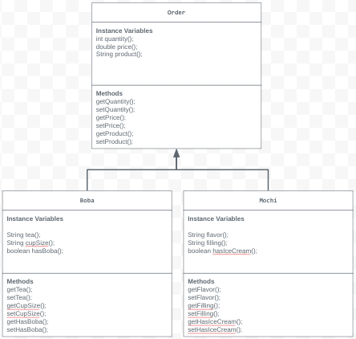

# store-management
# Unit 2 - Store Management Project

## Introduction

You are opening a new business in your community! Businesses often need programs to manage the products and services they offer and track orders and requests from customers. Your goal is to create a store management system for your business.

## Requirements

Use your knowledge of object-oriented programming and class structure and design to create your store management system:
- **Create a class hierarchy** – Develop a superclass that represents a product or service your business offers and one or more subclasses that extend the superclass to represent more specific types of products or services.
- **Declare instance variables** – Declare instance variables in the superclass that are shared with the subclasses and instance variables in the subclasses that are not shared with the superclass.
- **Write constructors** – Write no-argument and parameterized constructors in the superclass and subclasses. Subclass constructors use the super keyword to call the superclass constructor.
- **Implement accessor and mutator methods** – Write accessor and mutator methods for instance variables that should be accessible and/or modifiable from outside of the class.
- **Implement a toString() method** – Write toString() methods in the superclass and subclasses that return information about the state of an object.

## UML Diagram

Put and image of your UML Diagram here. Upload the image of your UML Diagram to your repository, then use the Markdown syntax to insert your image here.

## Description

I created a boba shop were people could purchase boba drinks and eat snacks such as mochi. My superclass for the project is order and my two subclasses are boba and mochi. These two subclasses take the instance variables of the superclass to help guide the costume through their order. For example, an instance variable in my superclass order is product. The purpose of product is the provide the custumer with the correct question, the questions differing depending on if they are ordering boba or mochi. To acomplish this I use my variable product and an if statement to create branches. For instance, the customer types in the product boba. The first thing they will be asked is what tea they would like for their drink, it then goes on to go through the other variables. Through this my program will expect different data types like String, double, and boolean. This information is used to output information because a recipt is printed at the end of the order, using the provided information.